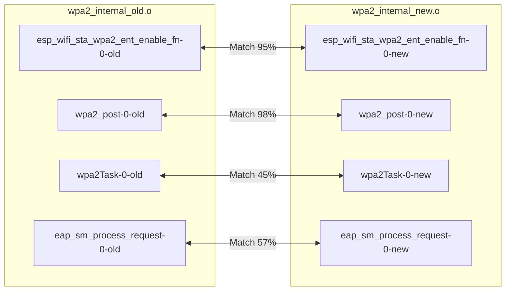
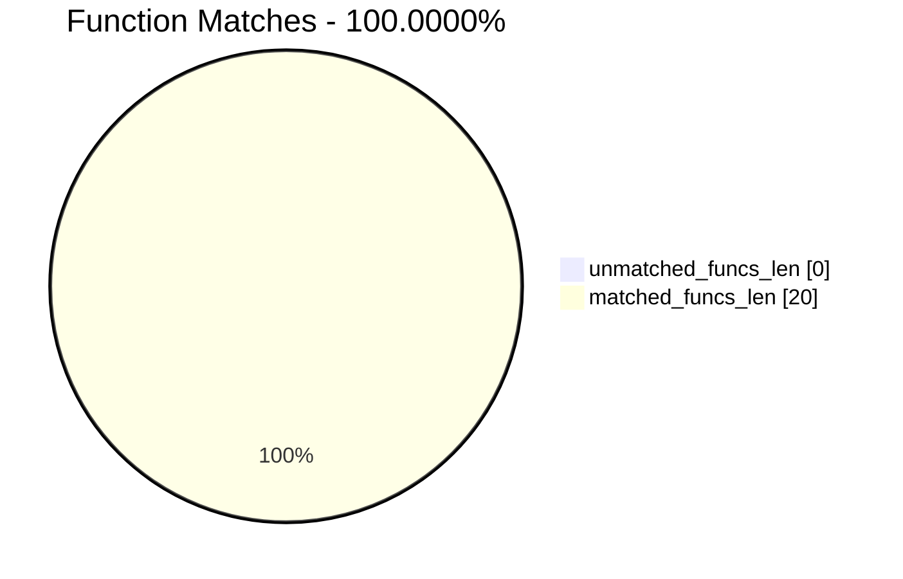
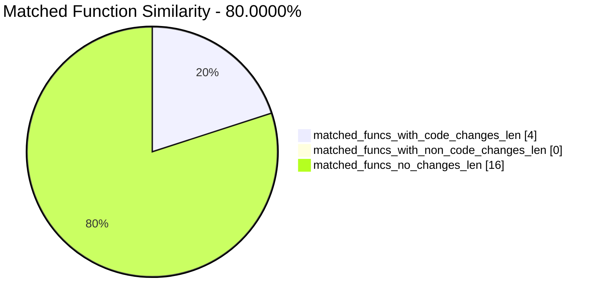
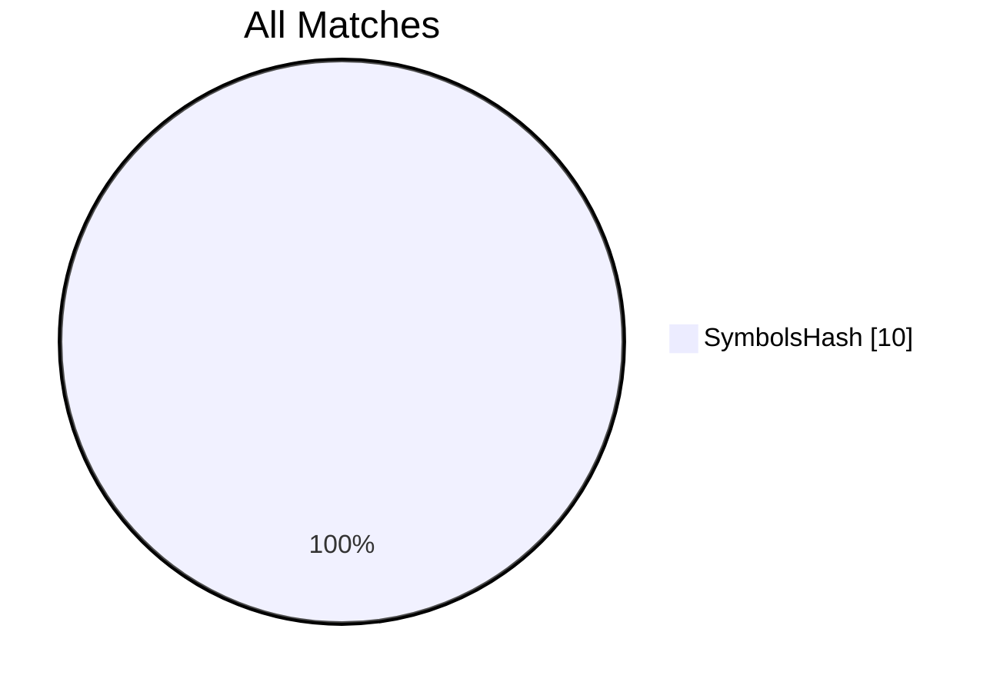
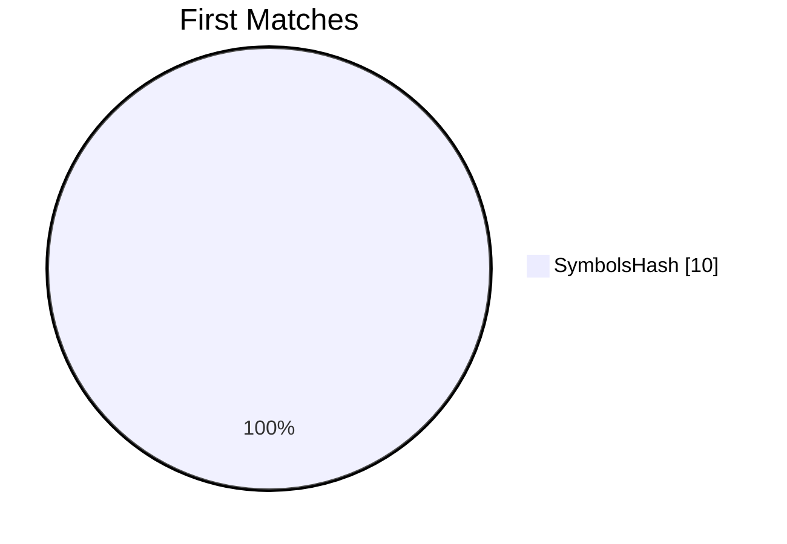
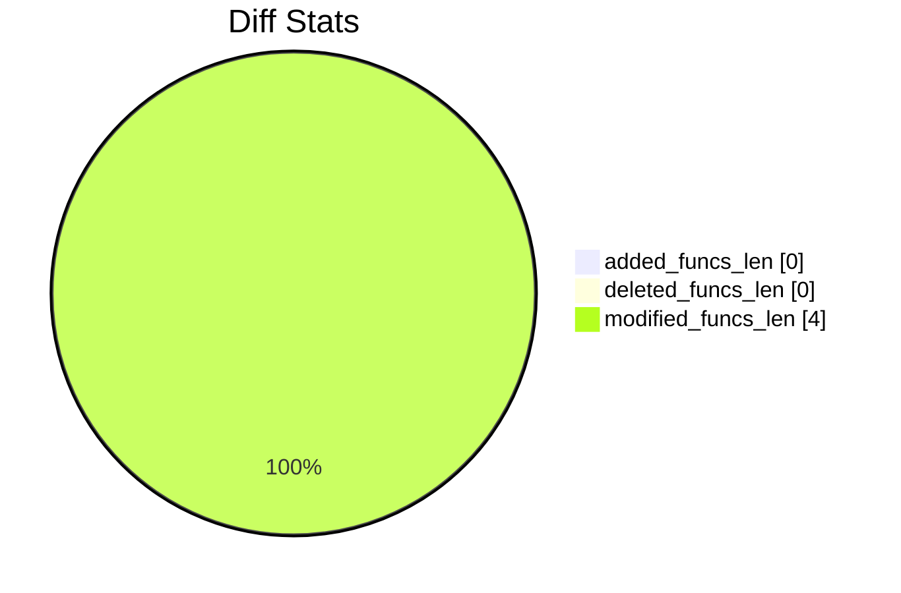

# wpa2_internal_old.o-wpa2_internal_new.o Diff

# TOC

* [Visual Chart Diff](#visual-chart-diff)
* [Metadata](#metadata)
	* [Ghidra Diff Engine](#ghidra-diff-engine)
		* [Command Line](#command-line)
	* [Binary Metadata Diff](#binary-metadata-diff)
	* [Program Options](#program-options)
	* [Diff Stats](#diff-stats)
	* [Strings](#strings)
* [Deleted](#deleted)
* [Added](#added)
* [Modified](#modified)
	* [esp_wifi_sta_wpa2_ent_enable_fn](#esp_wifi_sta_wpa2_ent_enable_fn)
	* [wpa2_post](#wpa2_post)
	* [wpa2Task](#wpa2task)
	* [eap_sm_process_request](#eap_sm_process_request)
* [Modified (No Code Changes)](#modified-no-code-changes)

# Visual Chart Diff










# Metadata

## Ghidra Diff Engine

### Command Line

#### Captured Command Line


```
ghidriff --project-location ghidra_projects --project-name ghidriff --symbols-path symbols --threaded --log-level INFO --file-log-level INFO --log-path ghidriff.log --min-func-len 10 --bsim --max-ram-percent 60.0 --max-section-funcs 200 wpa2_internal_old.o wpa2_internal_new.o
```


#### Verbose Args


<details>

```
--old ['wpa2_internal_old.o'] --new [['wpa2_internal_new.o']] --engine VersionTrackingDiff --output-path ghidriffs --summary False --project-location ghidra_projects --project-name ghidriff --symbols-path symbols --threaded True --force-analysis False --force-diff False --no-symbols False --log-level INFO --file-log-level INFO --log-path ghidriff.log --va False --min-func-len 10 --use-calling-counts False --bsim True --bsim-full False --max-ram-percent 60.0 --print-flags False --jvm-args None --side-by-side False --max-section-funcs 200 --md-title None
```


</details>

## Binary Metadata Diff


```diff
--- wpa2_internal_old.o Meta
+++ wpa2_internal_new.o Meta
@@ -1,32 +1,32 @@
-Program Name: wpa2_internal_old.o
+Program Name: wpa2_internal_new.o
 Language ID: Xtensa:LE:32:default (4.0)
 Compiler ID: default
 Processor: Xtensa
 Endian: Little
 Address Size: 32
 Minimum Address: 00010000
-Maximum Address: _elfSectionHeaders::00000ac7
-# of Bytes: 24605
-# of Memory Blocks: 52
-# of Instructions: 987
-# of Defined Data: 268
+Maximum Address: _elfSectionHeaders::00000a4f
+# of Bytes: 25654
+# of Memory Blocks: 50
+# of Instructions: 1058
+# of Defined Data: 272
 # of Functions: 10
 # of Symbols: 53
-# of Data Types: 30
+# of Data Types: 31
 # of Data Type Categories: 2
 Analyzed: true
 Created With Ghidra Version: 11.0
-Date Created: Fri Mar 29 20:03:41 CST 2024
+Date Created: Fri Mar 29 20:03:42 CST 2024
 ELF File Type: relocatable
 ELF Original Image Base: 0x0
 ELF Prelinked: false
 Elf Comment[0]: 
 Elf Comment[1]: GCC: (crosstool-NG crosstool-ng-1.22.0-78-g4b87650) 5.2.0
 Executable Format: Executable and Linking Format (ELF)
-Executable Location: /data/git/esp/CVE-2019-12586-7/ghidriffs/wpa2_internal_old.o
-Executable MD5: f799e287e6642322ec8ca45689fcfd86
-Executable SHA256: ee0a7f244216a70a2c43f1eeb28dd2cf182649ffa575290c976463e25910b69d
-FSRL: file:///data/git/esp/CVE-2019-12586-7/ghidriffs/wpa2_internal_old.o?MD5=f799e287e6642322ec8ca45689fcfd86
+Executable Location: /data/git/esp/CVE-2019-12586-7/ghidriffs/wpa2_internal_new.o
+Executable MD5: 91e0c69a6219f27347ebca041605dd87
+Executable SHA256: 1b744a64b6455bb94a50ae9689a7ef37f5f8b90262163e2fe8bed744d2583cee
+FSRL: file:///data/git/esp/CVE-2019-12586-7/ghidriffs/wpa2_internal_new.o?MD5=91e0c69a6219f27347ebca041605dd87
 Preferred Root Namespace Category: 
 Relocatable: true
 Should Ask To Analyze: false

```


## Program Options


<details>
<summary>Ghidra wpa2_internal_old.o Decompiler Options</summary>


|Decompiler Option|Value|
| :---: | :---: |
|Prototype Evaluation|__stdcall|

</details>


<details>
<summary>Ghidra wpa2_internal_old.o Specification extensions Options</summary>


|Specification extensions Option|Value|
| :---: | :---: |
|FormatVersion|0|
|VersionCounter|0|

</details>


<details>
<summary>Ghidra wpa2_internal_old.o Analyzers Options</summary>


|Analyzers Option|Value|
| :---: | :---: |
|ASCII Strings|true|
|ASCII Strings.Create Strings Containing Existing Strings|true|
|ASCII Strings.Create Strings Containing References|true|
|ASCII Strings.Force Model Reload|false|
|ASCII Strings.Minimum String Length|LEN_5|
|ASCII Strings.Model File|StringModel.sng|
|ASCII Strings.Require Null Termination for String|true|
|ASCII Strings.Search Only in Accessible Memory Blocks|true|
|ASCII Strings.String Start Alignment|ALIGN_1|
|ASCII Strings.String end alignment|4|
|Aggressive Instruction Finder|false|
|Aggressive Instruction Finder.Create Analysis Bookmarks|true|
|Apply Data Archives|true|
|Apply Data Archives.Archive Chooser|[Auto-Detect]|
|Apply Data Archives.Create Analysis Bookmarks|true|
|Apply Data Archives.GDT User File Archive Path|None|
|Apply Data Archives.User Project Archive Path|None|
|Basic Constant Reference Analyzer|true|
|Basic Constant Reference Analyzer.Create Data from pointer|false|
|Basic Constant Reference Analyzer.Function parameter/return Pointer analysis|true|
|Basic Constant Reference Analyzer.Max Threads|2|
|Basic Constant Reference Analyzer.Min absolute reference|4|
|Basic Constant Reference Analyzer.Require pointer param data type|false|
|Basic Constant Reference Analyzer.Speculative reference max|256|
|Basic Constant Reference Analyzer.Speculative reference min|512|
|Basic Constant Reference Analyzer.Stored Value Pointer analysis|true|
|Basic Constant Reference Analyzer.Trust values read from writable memory|true|
|Call Convention ID|true|
|Call Convention ID.Analysis Decompiler Timeout (sec)|60|
|Call-Fixup Installer|true|
|Condense Filler Bytes|false|
|Condense Filler Bytes.Filler Value|Auto|
|Condense Filler Bytes.Minimum number of sequential bytes|1|
|Create Address Tables|true|
|Create Address Tables.Allow Offcut References|false|
|Create Address Tables.Auto Label Table|false|
|Create Address Tables.Create Analysis Bookmarks|true|
|Create Address Tables.Maxmimum Pointer Distance|16777215|
|Create Address Tables.Minimum Pointer Address|4132|
|Create Address Tables.Minimum Table Size|2|
|Create Address Tables.Pointer Alignment|1|
|Create Address Tables.Relocation Table Guide|true|
|Create Address Tables.Table Alignment|4|
|Data Reference|true|
|Data Reference.Address Table Alignment|1|
|Data Reference.Address Table Minimum Size|2|
|Data Reference.Align End of Strings|false|
|Data Reference.Ascii String References|true|
|Data Reference.Create Address Tables|false|
|Data Reference.Minimum String Length|5|
|Data Reference.References to Pointers|true|
|Data Reference.Relocation Table Guide|true|
|Data Reference.Respect Execute Flag|true|
|Data Reference.Subroutine References|true|
|Data Reference.Switch Table References|false|
|Data Reference.Unicode String References|true|
|Decompiler Parameter ID|false|
|Decompiler Parameter ID.Analysis Clear Level|ANALYSIS|
|Decompiler Parameter ID.Analysis Decompiler Timeout (sec)|60|
|Decompiler Parameter ID.Commit Data Types|true|
|Decompiler Parameter ID.Commit Void Return Values|false|
|Decompiler Parameter ID.Prototype Evaluation|__stdcall|
|Decompiler Switch Analysis|true|
|Decompiler Switch Analysis.Analysis Decompiler Timeout (sec)|60|
|Demangler GNU|true|
|Demangler GNU.Apply Function Calling Conventions|true|
|Demangler GNU.Apply Function Signatures|true|
|Demangler GNU.Demangle Only Known Mangled Symbols|false|
|Demangler GNU.Demangler Format|AUTO|
|Demangler GNU.Use Deprecated Demangler|false|
|Disassemble Entry Points|true|
|Disassemble Entry Points.Respect Execute Flag|true|
|ELF Scalar Operand References|true|
|ELF Scalar Operand References.Relocation Table Guide|true|
|Embedded Media|true|
|Embedded Media.Create Analysis Bookmarks|true|
|External Entry References|true|
|External Symbol Resolver|true|
|Function Start Search|true|
|Function Start Search After Code|true|
|Function Start Search After Code.Bookmark Functions|false|
|Function Start Search After Code.Search Data Blocks|false|
|Function Start Search After Data|true|
|Function Start Search After Data.Bookmark Functions|false|
|Function Start Search After Data.Search Data Blocks|false|
|Function Start Search.Bookmark Functions|false|
|Function Start Search.Search Data Blocks|false|
|Non-Returning Functions - Discovered|true|
|Non-Returning Functions - Discovered.Create Analysis Bookmarks|true|
|Non-Returning Functions - Discovered.Function Non-return Threshold|3|
|Non-Returning Functions - Discovered.Repair Flow Damage|true|
|Non-Returning Functions - Known|true|
|Non-Returning Functions - Known.Create Analysis Bookmarks|true|
|Reference|true|
|Reference.Address Table Alignment|1|
|Reference.Address Table Minimum Size|2|
|Reference.Align End of Strings|false|
|Reference.Ascii String References|true|
|Reference.Create Address Tables|false|
|Reference.Minimum String Length|5|
|Reference.References to Pointers|true|
|Reference.Relocation Table Guide|true|
|Reference.Respect Execute Flag|true|
|Reference.Subroutine References|true|
|Reference.Switch Table References|false|
|Reference.Unicode String References|true|
|Shared Return Calls|true|
|Shared Return Calls.Allow Conditional Jumps|false|
|Shared Return Calls.Assume Contiguous Functions Only|true|
|Stack|true|
|Stack.Create Local Variables|true|
|Stack.Create Param Variables|true|
|Stack.useNewFunctionStackAnalysis|true|
|Subroutine References|true|
|Subroutine References.Create Thunks Early|true|
|Variadic Function Signature Override|false|
|Variadic Function Signature Override.Create Analysis Bookmarks|false|

</details>


<details>
<summary>Ghidra wpa2_internal_new.o Decompiler Options</summary>


|Decompiler Option|Value|
| :---: | :---: |
|Prototype Evaluation|__stdcall|

</details>


<details>
<summary>Ghidra wpa2_internal_new.o Specification extensions Options</summary>


|Specification extensions Option|Value|
| :---: | :---: |
|FormatVersion|0|
|VersionCounter|0|

</details>


<details>
<summary>Ghidra wpa2_internal_new.o Analyzers Options</summary>


|Analyzers Option|Value|
| :---: | :---: |
|ASCII Strings|true|
|ASCII Strings.Create Strings Containing Existing Strings|true|
|ASCII Strings.Create Strings Containing References|true|
|ASCII Strings.Force Model Reload|false|
|ASCII Strings.Minimum String Length|LEN_5|
|ASCII Strings.Model File|StringModel.sng|
|ASCII Strings.Require Null Termination for String|true|
|ASCII Strings.Search Only in Accessible Memory Blocks|true|
|ASCII Strings.String Start Alignment|ALIGN_1|
|ASCII Strings.String end alignment|4|
|Aggressive Instruction Finder|false|
|Aggressive Instruction Finder.Create Analysis Bookmarks|true|
|Apply Data Archives|true|
|Apply Data Archives.Archive Chooser|[Auto-Detect]|
|Apply Data Archives.Create Analysis Bookmarks|true|
|Apply Data Archives.GDT User File Archive Path|None|
|Apply Data Archives.User Project Archive Path|None|
|Basic Constant Reference Analyzer|true|
|Basic Constant Reference Analyzer.Create Data from pointer|false|
|Basic Constant Reference Analyzer.Function parameter/return Pointer analysis|true|
|Basic Constant Reference Analyzer.Max Threads|2|
|Basic Constant Reference Analyzer.Min absolute reference|4|
|Basic Constant Reference Analyzer.Require pointer param data type|false|
|Basic Constant Reference Analyzer.Speculative reference max|256|
|Basic Constant Reference Analyzer.Speculative reference min|512|
|Basic Constant Reference Analyzer.Stored Value Pointer analysis|true|
|Basic Constant Reference Analyzer.Trust values read from writable memory|true|
|Call Convention ID|true|
|Call Convention ID.Analysis Decompiler Timeout (sec)|60|
|Call-Fixup Installer|true|
|Condense Filler Bytes|false|
|Condense Filler Bytes.Filler Value|Auto|
|Condense Filler Bytes.Minimum number of sequential bytes|1|
|Create Address Tables|true|
|Create Address Tables.Allow Offcut References|false|
|Create Address Tables.Auto Label Table|false|
|Create Address Tables.Create Analysis Bookmarks|true|
|Create Address Tables.Maxmimum Pointer Distance|16777215|
|Create Address Tables.Minimum Pointer Address|4132|
|Create Address Tables.Minimum Table Size|2|
|Create Address Tables.Pointer Alignment|1|
|Create Address Tables.Relocation Table Guide|true|
|Create Address Tables.Table Alignment|4|
|Data Reference|true|
|Data Reference.Address Table Alignment|1|
|Data Reference.Address Table Minimum Size|2|
|Data Reference.Align End of Strings|false|
|Data Reference.Ascii String References|true|
|Data Reference.Create Address Tables|false|
|Data Reference.Minimum String Length|5|
|Data Reference.References to Pointers|true|
|Data Reference.Relocation Table Guide|true|
|Data Reference.Respect Execute Flag|true|
|Data Reference.Subroutine References|true|
|Data Reference.Switch Table References|false|
|Data Reference.Unicode String References|true|
|Decompiler Parameter ID|false|
|Decompiler Parameter ID.Analysis Clear Level|ANALYSIS|
|Decompiler Parameter ID.Analysis Decompiler Timeout (sec)|60|
|Decompiler Parameter ID.Commit Data Types|true|
|Decompiler Parameter ID.Commit Void Return Values|false|
|Decompiler Parameter ID.Prototype Evaluation|__stdcall|
|Decompiler Switch Analysis|true|
|Decompiler Switch Analysis.Analysis Decompiler Timeout (sec)|60|
|Demangler GNU|true|
|Demangler GNU.Apply Function Calling Conventions|true|
|Demangler GNU.Apply Function Signatures|true|
|Demangler GNU.Demangle Only Known Mangled Symbols|false|
|Demangler GNU.Demangler Format|AUTO|
|Demangler GNU.Use Deprecated Demangler|false|
|Disassemble Entry Points|true|
|Disassemble Entry Points.Respect Execute Flag|true|
|ELF Scalar Operand References|true|
|ELF Scalar Operand References.Relocation Table Guide|true|
|Embedded Media|true|
|Embedded Media.Create Analysis Bookmarks|true|
|External Entry References|true|
|External Symbol Resolver|true|
|Function Start Search|true|
|Function Start Search After Code|true|
|Function Start Search After Code.Bookmark Functions|false|
|Function Start Search After Code.Search Data Blocks|false|
|Function Start Search After Data|true|
|Function Start Search After Data.Bookmark Functions|false|
|Function Start Search After Data.Search Data Blocks|false|
|Function Start Search.Bookmark Functions|false|
|Function Start Search.Search Data Blocks|false|
|Non-Returning Functions - Discovered|true|
|Non-Returning Functions - Discovered.Create Analysis Bookmarks|true|
|Non-Returning Functions - Discovered.Function Non-return Threshold|3|
|Non-Returning Functions - Discovered.Repair Flow Damage|true|
|Non-Returning Functions - Known|true|
|Non-Returning Functions - Known.Create Analysis Bookmarks|true|
|Reference|true|
|Reference.Address Table Alignment|1|
|Reference.Address Table Minimum Size|2|
|Reference.Align End of Strings|false|
|Reference.Ascii String References|true|
|Reference.Create Address Tables|false|
|Reference.Minimum String Length|5|
|Reference.References to Pointers|true|
|Reference.Relocation Table Guide|true|
|Reference.Respect Execute Flag|true|
|Reference.Subroutine References|true|
|Reference.Switch Table References|false|
|Reference.Unicode String References|true|
|Shared Return Calls|true|
|Shared Return Calls.Allow Conditional Jumps|false|
|Shared Return Calls.Assume Contiguous Functions Only|true|
|Stack|true|
|Stack.Create Local Variables|true|
|Stack.Create Param Variables|true|
|Stack.useNewFunctionStackAnalysis|true|
|Subroutine References|true|
|Subroutine References.Create Thunks Early|true|
|Variadic Function Signature Override|false|
|Variadic Function Signature Override.Create Analysis Bookmarks|false|

</details>

## Diff Stats


|Stat|Value|
| :---: | :---: |
|added_funcs_len|0|
|deleted_funcs_len|0|
|modified_funcs_len|4|
|added_symbols_len|0|
|deleted_symbols_len|0|
|diff_time|0.7095379829406738|
|deleted_strings_len|0|
|added_strings_len|0|
|match_types|Counter({'SymbolsHash': 10})|
|items_to_process|4|
|diff_types|Counter({'code': 4, 'length': 4, 'address': 4})|
|unmatched_funcs_len|0|
|total_funcs_len|20|
|matched_funcs_len|20|
|matched_funcs_with_code_changes_len|4|
|matched_funcs_with_non_code_changes_len|0|
|matched_funcs_no_changes_len|16|
|match_func_similarity_percent|80.0000%|
|func_match_overall_percent|100.0000%|
|first_matches|Counter({'SymbolsHash': 10})|











```mermaid
pie showData
    title Symbols
"added_symbols_len" : 0
"deleted_symbols_len" : 0
```

## Strings


*No string differences found*

# Deleted

# Added

# Modified


*Modified functions contain code changes*
## esp_wifi_sta_wpa2_ent_enable_fn

### Match Info


|Key|wpa2_internal_old.o - wpa2_internal_new.o|
| :---: | :---: |
|diff_type|code,length,address|
|ratio|0.27|
|i_ratio|0.56|
|m_ratio|0.93|
|b_ratio|0.95|
|match_types|SymbolsHash|

### Function Meta Diff


|Key|wpa2_internal_old.o|wpa2_internal_new.o|
| :---: | :---: | :---: |
|name|esp_wifi_sta_wpa2_ent_enable_fn|esp_wifi_sta_wpa2_ent_enable_fn|
|fullname|esp_wifi_sta_wpa2_ent_enable_fn|esp_wifi_sta_wpa2_ent_enable_fn|
|refcount|1|1|
|`length`|340|333|
|called|||
|calling|||
|paramcount|0|0|
|`address`|000105b8|0001062c|
|sig|undefined esp_wifi_sta_wpa2_ent_enable_fn(void)|undefined esp_wifi_sta_wpa2_ent_enable_fn(void)|
|sym_type|Function|Function|
|sym_source|IMPORTED|IMPORTED|
|external|False|False|

### esp_wifi_sta_wpa2_ent_enable_fn Diff


```diff
--- esp_wifi_sta_wpa2_ent_enable_fn
+++ esp_wifi_sta_wpa2_ent_enable_fn
@@ -1,59 +1,57 @@
 
 undefined4 esp_wifi_sta_wpa2_ent_enable_fn(int *param_1)
 
 {
   undefined4 uVar1;
   undefined4 *puVar2;
   int iVar3;
   code *pcVar4;
   
   if ((iRam00000000 != 0) && (pcVar4 = *(code **)(iRam00000000 + 0x11c), pcVar4 != (code *)0x0)) {
     uVar1 = (**(code **)(iRam00000000 + 0x120))();
     (*pcVar4)(3,8,0xc,uVar1,8,0);
   }
-  puVar2 = (undefined4 *)(**(code **)(iRam00000000 + 0x140))(0x14);
-  if (puVar2 != (undefined4 *)0x0) {
-    *puVar2 = 0x14;
-    puVar2[1] = 4;
-    puVar2[2] = 4;
-    puVar2[3] = 0x54;
-    puVar2[4] = 0x24;
-    (*(code *)0x0)();
-    (*(code *)0x0)(0,0,100);
-    if (*param_1 == 0) {
-      if ((iRam00000000 != 0) && (pcVar4 = *(code **)(iRam00000000 + 0x11c), pcVar4 != (code *)0x0))
-      {
-        uVar1 = (**(code **)(iRam00000000 + 0x120))();
-        (*pcVar4)(1,8,0xb8,uVar1,8,0);
-        return 0xffffffff;
-      }
+  puVar2 = (undefined4 *)(**(code **)(iRam00000000 + 0x140))(0x10);
+  if (puVar2 == (undefined4 *)0x0) {
+    if ((iRam00000000 != 0) && (pcVar4 = *(code **)(iRam00000000 + 0x11c), pcVar4 != (code *)0x0)) {
+      uVar1 = (**(code **)(iRam00000000 + 0x120))();
+      (*pcVar4)(1,8,0x40,uVar1,8);
+      return 0x101;
     }
-    else {
-      (*(code *)0x0)(0,*param_1,100);
-      if ((iRam00000000 == 100) && (iRam00000004 == 1)) {
-        if ((pcRam00000044 != (code *)0x0) &&
-           (((iVar3 = (*pcRam00000044)(), iVar3 != 0 && (iRam00000000 != 0)) &&
-            (pcVar4 = *(code **)(iRam00000000 + 0x11c), pcVar4 != (code *)0x0)))) {
-          uVar1 = (**(code **)(iRam00000000 + 0x120))();
-          (*pcVar4)(1,8,0xf8,uVar1,8);
-        }
-        iRam00000000 = CONCAT31(iRam00000000._1_3_,1);
-        memw();
-        return 0;
-      }
-      if ((iRam00000000 != 0) && (pcVar4 = *(code **)(iRam00000000 + 0x11c), pcVar4 != (code *)0x0))
-      {
-        uVar1 = (**(code **)(iRam00000000 + 0x120))();
-        (*pcVar4)(1,8,0x68,uVar1,8,100,1,iRam00000000,iRam00000004);
-      }
-    }
-    return 0xffffffff;
-  }
-  if ((iRam00000000 != 0) && (pcVar4 = *(code **)(iRam00000000 + 0x11c), pcVar4 != (code *)0x0)) {
-    uVar1 = (**(code **)(iRam00000000 + 0x120))();
-    (*pcVar4)(1,8,0x40,uVar1,8);
     return 0x101;
   }
-  return 0x101;
+  *puVar2 = 0x14;
+  puVar2[1] = 4;
+  puVar2[2] = 0x58;
+  puVar2[3] = 0x24;
+  (*(code *)0x0)();
+  (*(code *)0x0)(0,0,100);
+  if (*param_1 == 0) {
+    if ((iRam00000000 != 0) && (pcVar4 = *(code **)(iRam00000000 + 0x11c), pcVar4 != (code *)0x0)) {
+      uVar1 = (**(code **)(iRam00000000 + 0x120))();
+      (*pcVar4)(1,8,0xb8,uVar1,8,0);
+      return 0xffffffff;
+    }
+  }
+  else {
+    (*(code *)0x0)(0,*param_1,100);
+    if ((iRam00000000 == 100) && (iRam00000004 == 1)) {
+      if ((pcRam00000044 != (code *)0x0) &&
+         (((iVar3 = (*pcRam00000044)(), iVar3 != 0 && (iRam00000000 != 0)) &&
+          (pcVar4 = *(code **)(iRam00000000 + 0x11c), pcVar4 != (code *)0x0)))) {
+        uVar1 = (**(code **)(iRam00000000 + 0x120))();
+        (*pcVar4)(1,8,0xf8,uVar1,8);
+      }
+      iRam00000000 = CONCAT31(iRam00000000._1_3_,1);
+      memw();
+      return 0;
+    }
+    if ((iRam00000000 != 0) && (pcVar4 = *(code **)(iRam00000000 + 0x11c), pcVar4 != (code *)0x0)) {
+      uVar1 = (**(code **)(iRam00000000 + 0x120))();
+      (*pcVar4)(1,8,0x68,uVar1,8,100,1,iRam00000000,iRam00000004);
+      return 0xffffffff;
+    }
+  }
+  return 0xffffffff;
 }
 

```


## wpa2_post

### Match Info


|Key|wpa2_internal_old.o - wpa2_internal_new.o|
| :---: | :---: |
|diff_type|code,length,address|
|ratio|0.26|
|i_ratio|0.67|
|m_ratio|0.97|
|b_ratio|0.98|
|match_types|SymbolsHash|

### Function Meta Diff


|Key|wpa2_internal_old.o|wpa2_internal_new.o|
| :---: | :---: | :---: |
|name|wpa2_post|wpa2_post|
|fullname|wpa2_post|wpa2_post|
|refcount|1|1|
|`length`|250|255|
|called|||
|calling|||
|paramcount|0|0|
|`address`|0001078c|000107fc|
|sig|undefined wpa2_post(void)|undefined wpa2_post(void)|
|sym_type|Function|Function|
|sym_source|IMPORTED|IMPORTED|
|external|False|False|

### wpa2_post Diff


```diff
--- wpa2_post
+++ wpa2_post
@@ -1,55 +1,57 @@
 
-/* WARNING: Removing unreachable block (ram,0x00010866) */
-/* WARNING: Removing unreachable block (ram,0x0001086b) */
+/* WARNING: Removing unreachable block (ram,0x000108da) */
+/* WARNING: Removing unreachable block (ram,0x000108df) */
 
 undefined4 wpa2_post(int param_1,int param_2)
 
 {
   int iVar1;
-  undefined4 uVar2;
-  int iVar3;
-  code *pcVar4;
-  char *pcVar5;
+  int iVar2;
+  code *pcVar3;
+  char *pcVar4;
+  undefined4 uVar5;
   code *pcVar6;
   int *local_30 [12];
   
+  uVar5 = 0xffffffff;
   if (iRam00000000 != 0) {
-    pcVar5 = (char *)(iRam00000000 + param_1 + 0xaf);
-    if (*pcVar5 != '\0') {
-      return 0;
-    }
-    local_30[0] = (int *)(**(code **)(iRam00000000 + 0x134))(8);
-    iVar3 = iRam00000000;
-    if (local_30[0] == (int *)0x0) {
-      if ((iRam00000000 != 0) && (pcVar4 = *(code **)(iRam00000000 + 0x11c), pcVar4 != (code *)0x0))
-      {
-        uVar2 = (**(code **)(iRam00000000 + 0x120))();
-        (*pcVar4)(1,8,0x15c,uVar2,8);
+    pcVar4 = (char *)(iRam00000000 + param_1 + 0xaf);
+    uVar5 = 0;
+    if (*pcVar4 == '\0') {
+      local_30[0] = (int *)(**(code **)(iRam00000000 + 0x134))(8);
+      iVar2 = iRam00000000;
+      if (local_30[0] == (int *)0x0) {
+        if ((iRam00000000 != 0) &&
+           (pcVar3 = *(code **)(iRam00000000 + 0x11c), pcVar3 != (code *)0x0)) {
+          uVar5 = (**(code **)(iRam00000000 + 0x120))();
+          (*pcVar3)(1,8,0x15c,uVar5,8);
+        }
       }
-    }
-    else {
-      *pcVar5 = *pcVar5 + '\x01';
-      iVar1 = iRam00000000;
-      memw();
-      pcVar6 = *(code **)(iVar3 + 0x90);
-      *local_30[0] = param_1;
-      local_30[0][1] = param_2;
-      pcVar4 = *(code **)(iVar3 + 0x54);
-      uVar2 = (*pcVar6)(10);
-      iVar3 = (*pcVar4)(iVar1,local_30,uVar2);
-      if (iVar3 == 1) {
-        if (iRam00000000 != 0) {
-          (**(code **)(iRam00000000 + 0x2c))(iRam00000000,0xffffffff);
+      else {
+        *pcVar4 = *pcVar4 + '\x01';
+        iVar1 = iRam00000000;
+        memw();
+        pcVar6 = *(code **)(iVar2 + 0x90);
+        *local_30[0] = param_1;
+        local_30[0][1] = param_2;
+        pcVar3 = *(code **)(iVar2 + 0x54);
+        uVar5 = (*pcVar6)(10);
+        iVar2 = (*pcVar3)(iVar1,local_30,uVar5);
+        if (iVar2 == 1) {
+          if (iRam00000000 != 0) {
+            (**(code **)(iRam00000000 + 0x2c))(iRam00000000,0xffffffff);
+          }
+          return 0;
         }
-        return 0;
+        if ((iRam00000000 != 0) &&
+           (pcVar3 = *(code **)(iRam00000000 + 0x11c), pcVar3 != (code *)0x0)) {
+          uVar5 = (**(code **)(iRam00000000 + 0x120))();
+          (*pcVar3)(1,8,0x178,uVar5,8);
+        }
       }
-      if ((iRam00000000 != 0) && (pcVar4 = *(code **)(iRam00000000 + 0x11c), pcVar4 != (code *)0x0))
-      {
-        uVar2 = (**(code **)(iRam00000000 + 0x120))();
-        (*pcVar4)(1,8,0x178,uVar2,8);
-      }
+      uVar5 = 0xffffffff;
     }
   }
-  return 1;
+  return uVar5;
 }
 

```


## wpa2Task

### Match Info


|Key|wpa2_internal_old.o - wpa2_internal_new.o|
| :---: | :---: |
|diff_type|code,length,address|
|ratio|0.23|
|i_ratio|0.38|
|m_ratio|0.6|
|b_ratio|0.45|
|match_types|SymbolsHash|

### Function Meta Diff


|Key|wpa2_internal_old.o|wpa2_internal_new.o|
| :---: | :---: | :---: |
|name|wpa2Task|wpa2Task|
|fullname|wpa2Task|wpa2Task|
|refcount|1|1|
|`length`|756|822|
|called|||
|calling|||
|paramcount|0|0|
|`address`|000110ac|000111d8|
|sig|undefined wpa2Task(void)|undefined wpa2Task(void)|
|sym_type|Function|Function|
|sym_source|IMPORTED|IMPORTED|
|external|False|False|

### wpa2Task Diff


```diff
--- wpa2Task
+++ wpa2Task
@@ -1,146 +1,162 @@
 
-/* WARNING: Removing unreachable block (ram,0x00011356) */
-/* WARNING: Removing unreachable block (ram,0x0001135b) */
-/* WARNING: Removing unreachable block (ram,0x00011326) */
-/* WARNING: Removing unreachable block (ram,0x0001132c) */
+/* WARNING: Removing unreachable block (ram,0x000114c2) */
+/* WARNING: Removing unreachable block (ram,0x000114c7) */
+/* WARNING: Removing unreachable block (ram,0x00011492) */
+/* WARNING: Removing unreachable block (ram,0x00011498) */
 
 void wpa2Task(void)
 
 {
-  code cVar1;
-  code *pcVar2;
+  char cVar1;
+  int iVar2;
   int iVar3;
-  code *pcVar4;
-  undefined4 uVar5;
-  int iVar6;
-  uint uVar7;
+  int iVar4;
+  int iVar5;
+  undefined4 uVar6;
+  code *pcVar7;
   code *pcVar8;
   undefined auStack_40 [8];
   code *pcStack_38;
   int *piStack_34;
-  int iStack_30;
-  code *pcStack_2c;
-  code *pcStack_28;
+  code *pcStack_30;
+  int iStack_2c;
   
-  pcVar2 = pcRam00000000;
-  if (pcRam00000000 == (code *)0x0) {
+  iVar2 = iRam00000000;
+  if (iRam00000000 == 0) {
     return;
   }
   do {
-    iVar3 = (**(code **)(pcRam00000000 + 100))(pcRam00000000,&piStack_34,0xffffffff);
-    pcVar8 = pcRam00000000;
+    iVar3 = (**(code **)(iRam00000000 + 100))(iRam00000000,&piStack_34,0xffffffff);
+    iVar5 = iRam00000000;
     if (iVar3 == 1) {
       iVar3 = *piStack_34;
       if (iVar3 == 1) {
-        pcVar2[0xb0] = (code)((char)pcVar2[0xb0] + -1);
+        *(char *)(iVar2 + 0xb0) = *(char *)(iVar2 + 0xb0) + -1;
         memw();
-        iVar3 = piStack_34[1];
-        if (iVar3 != 0) {
-          pcVar8 = *(code **)(iVar3 + 0xc);
-          if ((7 < *(uint *)(iVar3 + 0x10)) &&
-             (uVar7 = (uint)(pcRam00000000 == (code *)0x0), pcRam00000000 != (code *)0x0)) {
-            if (pcVar8[1] == (code)0x0) {
-              uVar7 = *(uint *)(iVar3 + 0x10) - 4;
-              if ((CONCAT11(pcVar8[2],pcVar8[3]) < 4) || (uVar7 < CONCAT11(pcVar8[2],pcVar8[3]))) {
-LAB_0:
-                uVar7 = 0;
+        iVar5 = piStack_34[1];
+        if (iVar5 != 0) {
+          iVar3 = *(int *)(iVar5 + 0xc);
+          if ((7 < *(uint *)(iVar5 + 0x10)) && (iRam00000000 != 0)) {
+            if (*(char *)(iVar3 + 1) == '\0') {
+              pcVar8 = (code *)(*(uint *)(iVar5 + 0x10) - 4);
+              pcVar7 = (code *)(uint)CONCAT11(*(undefined *)(iVar3 + 2),*(undefined *)(iVar3 + 3));
+              if ((pcVar7 < (code *)0x4) || (pcVar8 < pcVar7)) goto LAB_0;
+              iStack_2c = iRam00000000;
+              pcStack_30 = pcVar8;
+              (*(code *)0x0)(0,0x490,iVar3);
+              cVar1 = *(char *)(iVar3 + 4);
+              if (cVar1 == '\x03') {
+                if (*(int *)(iStack_2c + 0xbc) == 0) {
+                  if ((iRam00000000 != 0) && (*(code **)(iRam00000000 + 0x11c) != (code *)0x0)) {
+                    pcStack_30 = *(code **)(iRam00000000 + 0x11c);
+                    uVar6 = (**(code **)(iRam00000000 + 0x120))();
+                    (*pcStack_30)(3,8,0x4cc,uVar6,8);
+                  }
+                  goto LAB_1;
+                }
+                (*(code *)0x0)();
+                (**(code **)(iRam00000000 + 0xa0))(*(undefined4 *)(iStack_2c + 0xbc));
+                iVar3 = iRam00000000;
+                *(undefined4 *)(iStack_2c + 0xbc) = 0;
+                if ((iVar3 != 0) && (*(code **)(iVar3 + 0x11c) != (code *)0x0)) {
+                  pcStack_30 = *(code **)(iVar3 + 0x11c);
+                  uVar6 = (**(code **)(iVar3 + 0x120))();
+                  (*pcStack_30)(3,8,0x4ac,uVar6,8);
+                }
+                if (iRam00000000 != 0) {
+                  *(undefined *)(iRam00000000 + 0xb2) = 2;
+                  memw();
+                  (*(code *)0x0)(2);
+                  uVar6 = 0;
+                  goto LAB_2;
+                }
+                goto LAB_0;
+              }
+              if (cVar1 == '\x04') {
+                if ((iRam00000000 != 0) && (*(code **)(iRam00000000 + 0x11c) != (code *)0x0)) {
+                  pcStack_30 = *(code **)(iRam00000000 + 0x11c);
+                  uVar6 = (**(code **)(iRam00000000 + 0x120))();
+                  (*pcStack_30)(3,8,0x524,uVar6,8);
+                }
+LAB_1:
+                if (iRam00000000 == 0) goto LAB_0;
+                *(undefined *)(iRam00000000 + 0xb2) = 3;
+                memw();
+                (*(code *)0x0)(3);
+                uVar6 = 0;
               }
               else {
-                pcStack_28 = pcRam00000000;
-                pcStack_2c = pcVar8;
-                (*(code *)0x0)(0,0x45c,pcVar8);
-                cVar1 = pcStack_2c[4];
-                if (cVar1 == (code)0x3) {
-                  (*(code *)0x0)(*(undefined4 *)(pcStack_28 + 0xbc));
-                  (**(code **)(pcRam00000000 + 0xa0))(*(undefined4 *)(pcStack_28 + 0xbc));
-                  pcVar8 = pcRam00000000;
-                  *(undefined4 *)(pcStack_28 + 0xbc) = 0;
-                  if ((pcVar8 != (code *)0x0) && (*(code **)(pcVar8 + 0x11c) != (code *)0x0)) {
-                    pcStack_2c = *(code **)(pcVar8 + 0x11c);
-                    uVar5 = (**(code **)(pcVar8 + 0x120))();
-                    (*pcStack_2c)(3,8,0x478,uVar5,8);
-                  }
-                  uVar7 = 0;
-                  pcStack_28[0xb2] = (code)0x1;
-                  memw();
-                }
-                else if (cVar1 == (code)0x4) {
-                  if ((pcRam00000000 != (code *)0x0) &&
-                     (*(code **)(pcRam00000000 + 0x11c) != (code *)0x0)) {
-                    pcStack_2c = *(code **)(pcRam00000000 + 0x11c);
-                    uVar5 = (**(code **)(pcRam00000000 + 0x120))();
-                    (*pcStack_2c)(3,8,0x498,uVar5,8);
-                  }
-                  uVar7 = 0;
-                  pcStack_28[0xb2] = (code)0x2;
-                  memw();
-                }
-                else {
-                  if (cVar1 != (code)0x1) goto LAB_0;
-                  uVar7 = (*(code *)0x0)(pcStack_2c + 4,uVar7);
-                  (*(code *)0x0)(pcStack_28,uVar7);
-                }
+                if (cVar1 != '\x01') goto LAB_0;
+                uVar6 = (*(code *)0x0)(iVar3 + 4,pcStack_30);
+                (*(code *)0x0)(iStack_2c,uVar6);
               }
             }
-            (*(code *)0x0)(uVar7);
-            pcVar8 = *(code **)(iVar3 + 0xc);
+            else {
+LAB_0:
+              uVar6 = 0;
+            }
+LAB_2:
+            (*(code *)0x0)(uVar6);
+            iVar3 = *(int *)(iVar5 + 0xc);
           }
-          (**(code **)(pcRam00000000 + 0xa0))(pcVar8);
-          (**(code **)(pcRam00000000 + 0xa0))(iVar3);
+          (**(code **)(iRam00000000 + 0xa0))(iVar3);
+          (**(code **)(iRam00000000 + 0xa0))(iVar5);
         }
+LAB_3:
+        (**(code **)(iRam00000000 + 0xa0))(piStack_34);
       }
       else {
-        if (iVar3 != 0) {
-          if (iVar3 == 2) {
-            (**(code **)(pcRam00000000 + 0xa0))();
-            (**(code **)(pcRam00000000 + 0x50))(pcRam00000000);
-            pcVar2 = pcRam00000000;
-            pcRam00000000 = (code *)0x0;
-            if (pcVar2 != (code *)0x0) {
-              (*pcRam00000030)();
+        if (iVar3 == 0) {
+          *(char *)(iVar2 + 0xaf) = *(char *)(iVar2 + 0xaf) + -1;
+          memw();
+          if (iVar5 != 0) {
+            iVar3 = (*(code *)0x0)(auStack_40);
+            if (iVar3 == 0) {
+              iVar3 = (*(code *)0x0)(iVar5,1,0x48c,0,&pcStack_38,0);
+              if (iVar3 != 0) {
+                if (iRam00000000 != 0) {
+                  *(undefined *)(iRam00000000 + 0xb2) = 1;
+                  iStack_2c = iVar3;
+                  (*(code *)0x0)(1);
+                  iVar3 = iStack_2c;
+                }
+                iVar4 = iVar3 + -0xe;
+                pcStack_30 = pcStack_38;
+                iStack_2c = iVar3;
+                (*(code *)0x0)(iVar4,auStack_40,6);
+                (*(code *)0x0)(iStack_2c + -8,iVar5 + 0xa9,6);
+                *(undefined *)(iVar3 + -2) = 0x88;
+                *(undefined *)(iVar3 + -1) = 0x8e;
+                memw();
+                (*(code *)0x0)(0,iVar4,(uint)(pcStack_30 + 0xe) & 0xffff);
+                (**(code **)(iRam00000000 + 0xa0))(iVar4);
+              }
             }
-            (**(code **)((int)pcRam00000000 + 0x88))(0);
-            return;
-          }
-          (**(code **)(pcRam00000000 + 0xa0))();
-          goto LAB_1;
-        }
-        pcVar2[0xaf] = (code)((char)pcVar2[0xaf] + -1);
-        memw();
-        if (pcVar8 != (code *)0x0) {
-          pcVar4 = (code *)(*(code *)0x0)(auStack_40);
-          if (pcVar4 == (code *)0x0) {
-            pcStack_28 = pcVar4;
-            iVar3 = (*(code *)0x0)(pcVar8,1,0x458,0,&pcStack_38,0);
-            if (iVar3 != 0) {
-              iStack_30 = iVar3;
-              (*(code *)0x0)(4);
-              iVar3 = iStack_30;
-              iVar6 = iStack_30 + -0xe;
-              pcStack_2c = pcStack_38;
-              (*(code *)0x0)(iVar6,auStack_40,6);
-              (*(code *)0x0)(iStack_30 + -8,pcVar8 + 0xa9,6);
-              *(undefined *)(iVar3 + -2) = 0x88;
-              *(undefined *)(iVar3 + -1) = 0x8e;
-              memw();
-              (*(code *)0x0)(pcStack_28,iVar6,(uint)(pcStack_2c + 0xe) & 0xffff);
-              (**(code **)(pcRam00000000 + 0xa0))(iVar6);
+            else if ((iRam00000000 != 0) && (*(code **)(iRam00000000 + 0x11c) != (code *)0x0)) {
+              pcStack_30 = *(code **)(iRam00000000 + 0x11c);
+              uVar6 = (**(code **)(iRam00000000 + 0x120))();
+              (*pcStack_30)(1,8,0x470,uVar6,8);
             }
           }
-          else if ((pcRam00000000 != (code *)0x0) &&
-                  (*(code **)(pcRam00000000 + 0x11c) != (code *)0x0)) {
-            pcStack_28 = *(code **)(pcRam00000000 + 0x11c);
-            uVar5 = (**(code **)(pcRam00000000 + 0x120))();
-            (*pcStack_28)(1,8,0x43c,uVar5,8);
+          goto LAB_3;
+        }
+        if (iVar3 == 2) {
+          (**(code **)(iRam00000000 + 0xa0))();
+          (**(code **)(iRam00000000 + 0x50))(iRam00000000);
+          iVar2 = iRam00000000;
+          iRam00000000 = 0;
+          if (iVar2 != 0) {
+            (*pcRam00000030)();
           }
+          (**(code **)(iRam00000000 + 0x88))(0);
+          return;
         }
+        (**(code **)(iRam00000000 + 0xa0))();
       }
-      (**(code **)(pcRam00000000 + 0xa0))(piStack_34);
     }
-LAB_1:
-    if (pcRam00000000 != (code *)0x0) {
-      (**(code **)(pcRam00000000 + 0x30))();
+    if (iRam00000000 != 0) {
+      (**(code **)(iRam00000000 + 0x30))();
     }
   } while( true );
 }
 

```


## eap_sm_process_request

### Match Info


|Key|wpa2_internal_old.o - wpa2_internal_new.o|
| :---: | :---: |
|diff_type|code,length,address|
|ratio|0.31|
|i_ratio|0.31|
|m_ratio|0.59|
|b_ratio|0.58|
|match_types|SymbolsHash|

### Function Meta Diff


|Key|wpa2_internal_old.o|wpa2_internal_new.o|
| :---: | :---: | :---: |
|name|eap_sm_process_request|eap_sm_process_request|
|fullname|eap_sm_process_request|eap_sm_process_request|
|refcount|1|1|
|`length`|528|669|
|called|||
|calling|||
|paramcount|0|0|
|`address`|00010e38|00010ecc|
|sig|undefined eap_sm_process_request(void)|undefined eap_sm_process_request(void)|
|sym_type|Function|Function|
|sym_source|IMPORTED|IMPORTED|
|external|False|False|

### eap_sm_process_request Diff


```diff
--- eap_sm_process_request
+++ eap_sm_process_request
@@ -1,126 +1,179 @@
 
 int eap_sm_process_request(int *param_1,int param_2)
 
 {
-  uint uVar1;
-  undefined4 uVar2;
+  undefined4 uVar1;
+  int iVar2;
   int iVar3;
-  int iVar4;
-  code *pcVar5;
-  uint *puVar6;
-  uint uVar7;
+  code *pcVar4;
+  uint uVar5;
+  uint uVar6;
+  uint *puVar7;
   uint uVar8;
   uint uVar9;
+  undefined4 uVar10;
   undefined auStack_30 [48];
   
   if (param_2 == 0) {
     return -1;
   }
   if (*(uint *)(param_2 + 4) < 4) {
     return -1;
   }
-  iVar4 = *(int *)(param_2 + 8);
+  iVar3 = *(int *)(param_2 + 8);
   if (*(int *)(param_2 + 8) == 0) {
-    iVar4 = param_2 + 0xc;
+    iVar3 = param_2 + 0xc;
   }
-  uVar7 = (uint)CONCAT11(*(undefined *)(iVar4 + 2),*(undefined *)(iVar4 + 3));
-  if (*(uint *)(param_2 + 4) < uVar7) {
+  uVar6 = (uint)CONCAT11(*(undefined *)(iVar3 + 2),*(undefined *)(iVar3 + 3));
+  if (*(uint *)(param_2 + 4) < uVar6) {
     return -1;
   }
-  if (*(char *)(param_1 + 0x2a) == *(char *)(iVar4 + 1)) {
-    iVar4 = param_1[0x31];
+  if (*(char *)(param_1 + 0x2a) == *(char *)(iVar3 + 1)) {
+    iVar3 = param_1[0x31];
+LAB_0:
+    if (iVar3 != 0) {
+LAB_1:
+      iVar2 = (*(code *)0x0)(param_1,iVar3);
+      if (iVar2 == 0) {
+        if (param_1[0x31] == iVar3) {
+          return 0;
+        }
+        (*(code *)0x0)();
+        param_1[0x31] = iVar3;
+        return 0;
+      }
+      (*(code *)0x0)();
+      param_1[0x31] = 0;
+      (*(code *)0x0)(iVar3);
+      if ((iVar2 == -2) && (iVar2 = 3, iRam00000000 != 0)) {
+        *(undefined *)(iRam00000000 + 0xb2) = 3;
+        memw();
+        (*(code *)0x0)(3);
+        return 3;
+      }
+      return iVar2;
+    }
   }
   else {
-    *(char *)(param_1 + 0x2a) = *(char *)(iVar4 + 1);
+    *(char *)(param_1 + 0x2a) = *(char *)(iVar3 + 1);
     memw();
-    uVar1 = (uint)*(byte *)(iVar4 + 4);
-    if (uVar1 == 1) {
-      if (pcRam0000005c == (code *)0x0) goto LAB_0;
-      iVar4 = (*pcRam0000005c)(param_1,*(undefined *)(iVar4 + 1),0);
-    }
-    else {
-      if (uVar1 == 2) {
+    uVar5 = (uint)*(byte *)(iVar3 + 4);
+    if (uVar5 != 1) {
+      if (uVar5 == 2) {
         return 0;
       }
       uVar8 = 0;
-      uVar9 = uVar1;
-      if (uVar1 == 0xfe) {
-        if (uVar7 < 0xc) {
+      uVar9 = uVar5;
+      if (uVar5 == 0xfe) {
+        if (uVar6 < 0xc) {
           return -1;
         }
-        uVar9 = (uint)*(byte *)(iVar4 + 8) << 0x18 | (uint)*(byte *)(iVar4 + 9) << 0x10 |
-                (uint)*(byte *)(iVar4 + 0xb) | (uint)*(byte *)(iVar4 + 10) << 8;
-        uVar8 = (uint)*(byte *)(iVar4 + 5) << 0x10 | (uint)*(byte *)(iVar4 + 6) << 8 |
-                (uint)*(byte *)(iVar4 + 7);
+        uVar9 = (uint)*(byte *)(iVar3 + 8) << 0x18 | (uint)*(byte *)(iVar3 + 9) << 0x10 |
+                (uint)*(byte *)(iVar3 + 0xb) | (uint)*(byte *)(iVar3 + 10) << 8;
+        uVar8 = (uint)*(byte *)(iVar3 + 5) << 0x10 | (uint)*(byte *)(iVar3 + 6) << 8 |
+                (uint)*(byte *)(iVar3 + 7);
       }
-      puVar6 = (uint *)param_1[0x32];
-      if ((((puVar6 == (uint *)0x0) || (*param_1 == 0)) || (uVar8 != *puVar6)) ||
-         (uVar9 != puVar6[1])) {
-        if ((pcRam00000050 != (code *)0x0) && (iVar3 = (*pcRam00000050)(), iVar3 != 0)) {
+      puVar7 = (uint *)param_1[0x32];
+      if ((((puVar7 == (uint *)0x0) || (*param_1 == 0)) || (uVar8 != *puVar7)) ||
+         (uVar9 != puVar7[1])) {
+        if ((pcRam00000050 != (code *)0x0) && (iVar2 = (*pcRam00000050)(), iVar2 != 0)) {
           if ((param_1[0x32] != 0) && (pcRam0000004c != (code *)0x0)) {
-            (*pcRam0000004c)(param_1,0x3cc);
+            (*pcRam0000004c)(param_1,0x400);
           }
-          pcVar5 = *(code **)(iVar3 + 0x10);
-          param_1[0x32] = iVar3;
-          iVar3 = (*pcVar5)(param_1);
-          *param_1 = iVar3;
-          if (iVar3 != 0) {
-            iVar4 = (**(code **)(param_1[0x32] + 0x18))(param_1,iVar3,auStack_30,param_2);
-            goto LAB_1;
+          pcVar4 = *(code **)(iVar2 + 0x10);
+          param_1[0x32] = iVar2;
+          iVar2 = (*pcVar4)(param_1);
+          *param_1 = iVar2;
+          if (iVar2 != 0) {
+            puVar7 = (uint *)param_1[0x32];
+            if ((code *)puVar7[6] == (code *)0x0) {
+              if (iRam00000000 != 0) {
+                pcVar4 = *(code **)(iRam00000000 + 0x11c);
+                if (pcVar4 != (code *)0x0) {
+                  uVar1 = (**(code **)(iRam00000000 + 0x120))();
+                  uVar10 = 0x194;
+                  goto LAB_2;
+                }
+                goto LAB_3;
+              }
+              goto LAB_4;
+            }
+            iVar3 = (*(code *)puVar7[6])(param_1,iVar2,auStack_30,param_2);
+            goto LAB_5;
           }
           if ((iRam00000000 != 0) &&
-             (pcVar5 = *(code **)(iRam00000000 + 0x11c), pcVar5 != (code *)0x0)) {
-            uVar2 = (**(code **)(iRam00000000 + 0x120))();
-            (*pcVar5)(1,8,0x3d8,uVar2,8);
+             (pcVar4 = *(code **)(iRam00000000 + 0x11c), pcVar4 != (code *)0x0)) {
+            uVar1 = (**(code **)(iRam00000000 + 0x120))();
+            (*pcVar4)(1,8,0x40c,uVar1,8);
           }
           param_1[0x32] = 0;
         }
         if (pcRam00000058 == (code *)0x0) {
           return -1;
         }
-        iVar4 = (*pcRam00000058)(param_1,uVar1,*(undefined *)(iVar4 + 1));
-        if (iVar4 == 0) {
+        iVar3 = (*pcRam00000058)(param_1,uVar5,*(undefined *)(iVar3 + 1));
+        if (iVar3 == 0) {
           return -1;
         }
-        goto LAB_2;
+        goto LAB_1;
       }
-      iVar4 = (*(code *)puVar6[6])(param_1,*param_1,auStack_30,param_2);
-LAB_1:
-      pcVar5 = *(code **)(param_1[0x32] + 0x1c);
-      if (((pcVar5 != (code *)0x0) && (*(int *)(param_1[0x32] + 0x20) != 0)) &&
-         (iVar3 = (*pcVar5)(param_1,*param_1), iVar3 != 0)) {
+      if ((code *)puVar7[6] == (code *)0x0) {
+        if (iRam00000000 == 0) {
+LAB_4:
+          pcVar4 = (code *)puVar7[7];
+          if (pcVar4 == (code *)0x0) {
+            return -1;
+          }
+        }
+        else {
+          pcVar4 = *(code **)(iRam00000000 + 0x11c);
+          if (pcVar4 == (code *)0x0) {
+LAB_3:
+            pcVar4 = (code *)puVar7[7];
+            if (pcVar4 == (code *)0x0) goto LAB_6;
+          }
+          else {
+            uVar1 = (**(code **)(iRam00000000 + 0x120))();
+            uVar10 = 0x17d;
+LAB_2:
+            (*pcVar4)(1,8,0x3cc,uVar1,8,uVar10);
+            puVar7 = (uint *)param_1[0x32];
+            pcVar4 = (code *)puVar7[7];
+            if (pcVar4 == (code *)0x0) goto LAB_7;
+          }
+        }
+        iVar3 = 0;
+        if (puVar7[8] == 0) goto LAB_7;
+      }
+      else {
+        iVar3 = (*(code *)puVar7[6])(param_1,*param_1,auStack_30,param_2);
+LAB_5:
+        pcVar4 = *(code **)(param_1[0x32] + 0x1c);
+        if ((pcVar4 == (code *)0x0) || (*(int *)(param_1[0x32] + 0x20) == 0)) goto LAB_0;
+      }
+      iVar2 = (*pcVar4)(param_1,*param_1);
+      if (iVar2 != 0) {
         (**(code **)(iRam00000000 + 0xa0))(param_1[0x2f]);
-        iVar3 = (**(code **)(param_1[0x32] + 0x20))(param_1,*param_1,param_1 + 0x30);
-        param_1[0x2f] = iVar3;
+        iVar2 = (**(code **)(param_1[0x32] + 0x20))(param_1,*param_1,param_1 + 0x30);
+        param_1[0x2f] = iVar2;
       }
+      goto LAB_0;
+    }
+    if (pcRam0000005c != (code *)0x0) {
+      iVar3 = (*pcRam0000005c)(param_1,*(undefined *)(iVar3 + 1),0);
+      goto LAB_0;
     }
   }
-  if (iVar4 == 0) {
-LAB_0:
-    if ((iRam00000000 != 0) && (pcVar5 = *(code **)(iRam00000000 + 0x11c), pcVar5 != (code *)0x0)) {
-      uVar2 = (**(code **)(iRam00000000 + 0x120))();
-      (*pcVar5)(1,8,0x410,uVar2,8);
-    }
+LAB_7:
+  if (iRam00000000 == 0) {
     return -1;
   }
-LAB_2:
-  iVar3 = (*(code *)0x0)(param_1,iVar4);
-  if (iVar3 != 0) {
-    (*(code *)0x0)();
-    param_1[0x31] = 0;
-    (*(code *)0x0)(iVar4);
-    if (iVar3 == -2) {
-      *(undefined *)((int)param_1 + 0xb2) = 2;
-      memw();
-      iVar3 = 2;
-    }
-    return iVar3;
+LAB_6:
+  pcVar4 = *(code **)(iRam00000000 + 0x11c);
+  if (pcVar4 != (code *)0x0) {
+    uVar1 = (**(code **)(iRam00000000 + 0x120))();
+    (*pcVar4)(1,8,0x444,uVar1,8);
   }
-  if (param_1[0x31] == iVar4) {
-    return 0;
-  }
-  (*(code *)0x0)();
-  param_1[0x31] = iVar4;
-  return 0;
+  return -1;
 }
 

```


# Modified (No Code Changes)


*Slightly modified functions have no code changes, rather differnces in:*
- refcount
- length
- called
- calling
- name
- fullname


<sub>Generated with `ghidriff` version: 0.6.0 on 2024-03-29T20:03:45</sub>